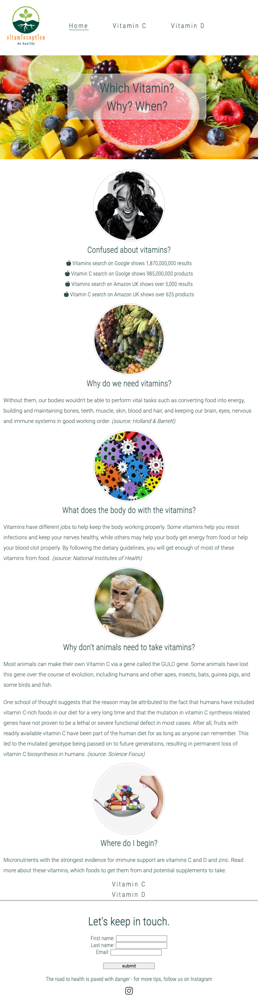
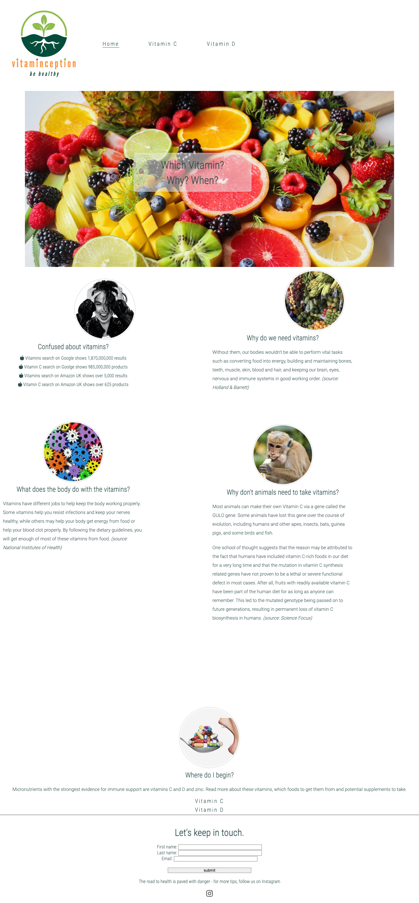
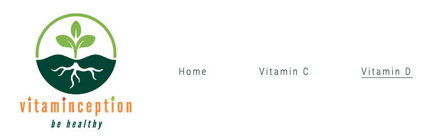
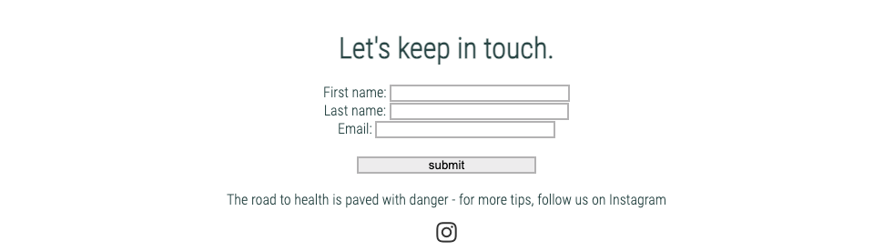

# PORTFOLIO PROJECT - 1

# VITAMINCEPTION

## Summary

Vitaminception is a guide for the big and complex worls of vitamins and supplements. A quick Google or Amazon search vitamins results in millions and billions of search results. There are hundreds of vitamin brands in the market and the product ingredients label is a mystery. If that wasn't enough, the advice from medical professionals, health coaches, nutritionists and of course the media are confusing and conflicting. Vitaminception takes this back to the beginning and explains the benefits of vitamins, the natural sources to obtain them and if necessary, the recommended supplements to take, in simple, plain terms.

According to datareportal.com, 92& of global internet users aged 16 to 64 go online via a mobile phone. For this reason, Vitaminception has been designed and developed with a mobile-first approach. Alternative views for tablets and desktops have also been provided for such users. 

## Features

Vitaminception explains each vitamin individually in very simple terms. Each vitamin type has its own unique page, with a short description on what the vitamin is for, how it's used by the body, what the benefits are, and the consequences of being deficient in this vitamin. Each vitamin page then goes on to cite external sources, cherry picked for the audience of this website; a short video, a scientific or medical research article, and a book. 

The final section of each vitamin page is a small shop area where a selection of only three vitamin products selected by the Vitaminception authors. The user will be able to click on these links to directly visit a shopping website and complete their purchase. 

Vitaminception business will have special commercial agreements with the selected three suppliers where the business will earn a commission on each purchase made in this way. 

### Navigation Bar 

Navigation bar appears on all pages, at the top, and includes a logo, links to all pages, and is fully responsive. The mobile view is stacked links, whereas tablet and desktop views display the navigation inline. 

### Footer

Footer includes a social media link to Instagram to invite the users to follow Vitaminception activities. A simple sign up form has also been added to the footer to invite the user to provide their email addresses in order to receive news and updates from Vitaminception.

### Vitamin C Page

External links and references have been used on the Vitamin C page in order to provide reliable information and also to gain credibility of the informaiton provided on the Vitaminception website. Vitamin C page refers to the following external links:

(list external sources)

### Vitamin D page

External links and references have been used on the Vitamin C page in order to provide reliable information and also to gain credibility of the informaiton provided on the Vitaminception website. itamin D page refers to the following external links:

(list external sources)

### Future Features 

Add affiliate links for commercial purposes
Add database link to connect the sign up form to, and store the users' email addresses
GDPR policy to comply with the regulations when collecting users' data

## Testing

The website has been tested on Chrome, Safari and Firefox latest versions.
It has also been tested on iphone standard and iphone plus screens, as well as laptop screen and a desktop device. 
Responsinator validator showed a broken text overlay on rotated landscpae view on mobile screens which has not been fixed in this version. 

### Validator Testing

HTML - No errors were returned when passing through the official W3C validator
CSS - No errors were found when passing through the official (Jigsaw) validator
Responsiveness - No errors were found when passing through the Responsinator validator

## Unfixed Bugs

Broken text overlay on rotated landscpae view on mobile screens which has not been fixed in this version. 

## Deployment

This section should describe the process you went through to deploy the project to a hosting platform (e.g. GitHub)

The site was deployed to GitHub pages. The steps to deploy are as follows:
In the GitHub repository, navigate to the Settings tab
From the source section drop-down menu, select the Master Branch
Once the master branch has been selected, the page will be automatically refreshed with a detailed ribbon display to indicate the successful deployment.
The live link can be found here - https://shadeofpurple79.github.io/vitaminception/ 

## Credits

### Content

Vitamins are not pharmaceuticals and therefore are not regulated as medicines. However, they are still used for their health benefits and therefore most of the content on the website were sourced from medical and scientific journals, or credible health publishers. 
https://www.nia.nih.gov
https://www.ncbi.nlm.nih.gov 
https://www.hsph.harvard.edu
http://sciencefocus.ust.hk
https://onlinelibrary.wiley.com

Recommended books were sourced from the World of Books website which sells used books - 
https://www.wob.com

Shop content and recommended product links are sourced from trusted sellers of vitamin propducts. 
https://www.hollandandbarrett.com
https://www.sainsburys.co.uk
https://www.dolphinfitness.co.uk

### Media

The photos used on the website were from Pexels.com a free stock photos website. The filename of the photos have been kept the same as was required by the Pexels site, in order to credit the photographers. https://www.pexels.com/ 

The videos used on the website have been taken from Youtube. Special attention has been taken to ensure that the resources are qualified medical profesisonals. https://www.youtube.com/ 
