# PORTFOLIO PROJECT - 1

# VITAMINCEPTION

## Summary

Vitaminception is a guide for the big and complex worls of vitamins and supplements. A quick Google or Amazon search vitamins results in millions and billions of search results. There are hundreds of vitamin brands in the market and the product ingredients label is a mystery. If that wasn't enough, the advice from medical professionals, health coaches, nutritionists and of course the media are confusing and conflicting. Vitaminception takes this back to the beginning and explains the benefits of vitamins, the natural sources to obtain them and if necessary, the recommended supplements to take, in simple, plain terms.

According to datareportal.com, 92& of global internet users aged 16 to 64 go online via a mobile phone. For this reason, Vitaminception has been designed and developed with a mobile-first approach. Alternative views for tablets and desktops have also been provided for such users. 

Mobile View 

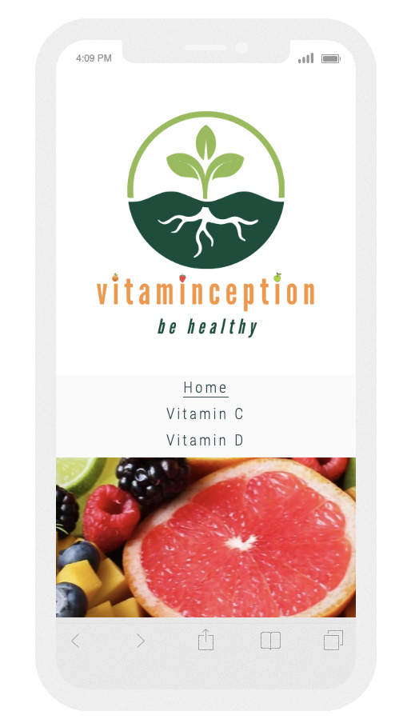

Tablet View 

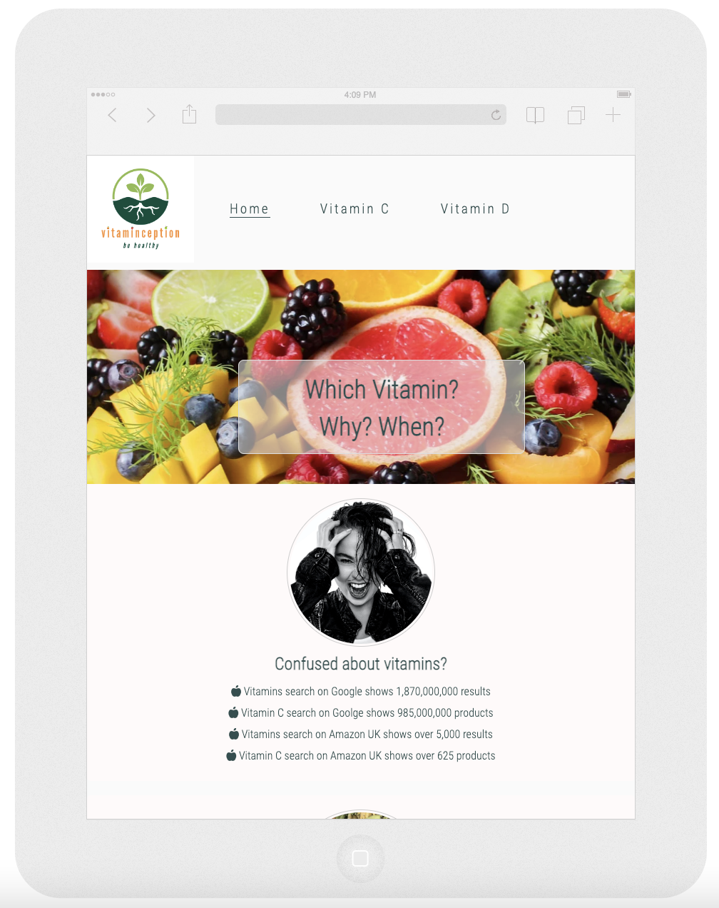

Desktop View 

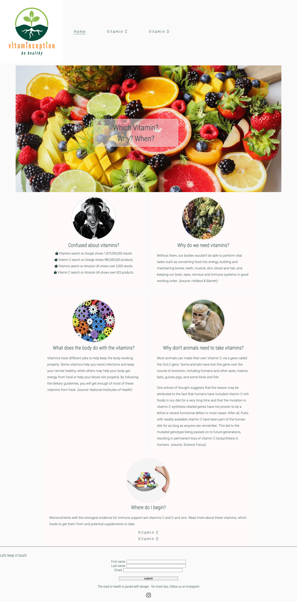

## Features

Vitaminception explains each vitamin individually in very simple terms. Each vitamin type has its own unique page, with a short description on what the vitamin is for, how it's used by the body, what the benefits are, and the consequences of being deficient in this vitamin. Each vitamin page then goes on to cite external sources, cherry picked for the audience of this website; a short video, a scientific or medical research article, and a book. 

The final section of each vitamin page is a small shop area where a selection of only three vitamin products selected by the Vitaminception authors. The user will be able to click on these links to directly visit a shopping website and complete their purchase. 

Vitaminception business will have special commercial agreements with the selected three suppliers where the business will earn a commission on each purchase made in this way. 

### Navigation Bar 

Navigation bar appears on all pages, at the top, and includes a logo, links to all pages, and is fully responsive. The mobile view is stacked links, whereas tablet and desktop views display the navigation inline. 

Navigation Mobile View

Navigation Tablet View 

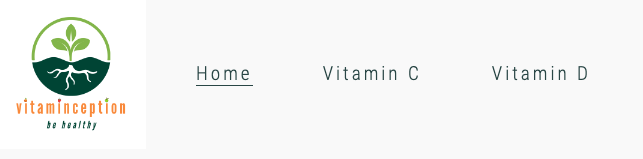

Navigation Desktop View 

### Footer

Footer includes a social media link to Instagram to invite the users to follow Vitaminception activities. A simple sign up form has also been added to the footer to invite the user to provide their email addresses in order to receive news and updates from Vitaminception.

Footer Mobile View

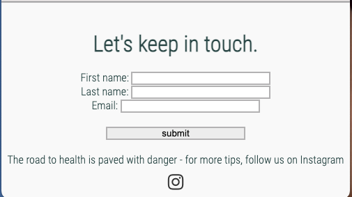

Footer Tablet View

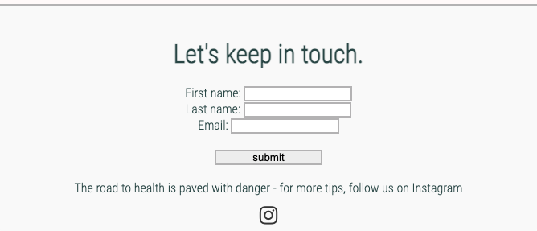

Footer Desktop View

### Index Page

the index page gives an overview of the purpose and objectives of the website for the audience. It introduces the common questions and issues for the average vitamin user, such as which vitamin to use, why vitamins are needed, what the body does with vitamins, and the natural sources of foods to obtain them from. 

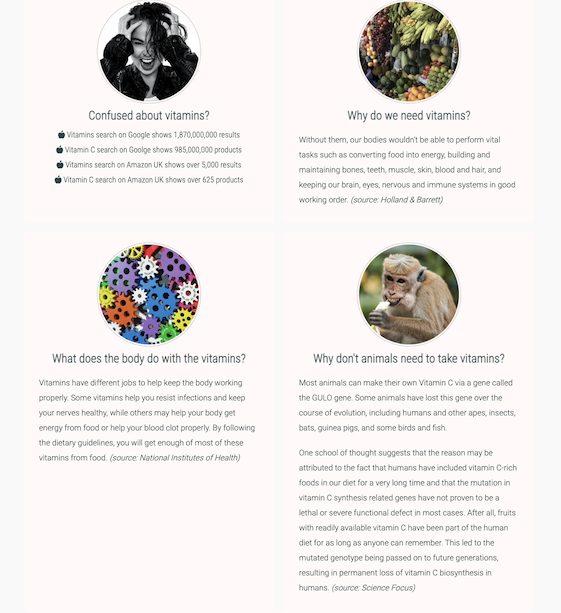

The index page guides the users to the rest of the website where detailed information can be found on each vitamin type. 

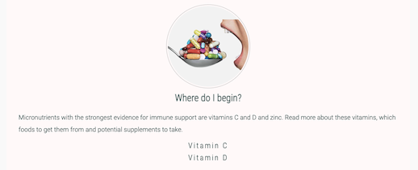

### Vitamin Detail Pages

Each vitamin page follows the same format to provide visual familiarity for the audience:
- A brief description and background
- Natural sources to obtain the vitamin without having to take supplements
- A section to read more about the vitamin from trustworthy resources, which includes:
    - A video
    - A scientific article
    - A book
- And finally a mini shop section consisting of three recommended products to buy, ideally in different "forms" of the vitamin, such as pill, tablet, gummy, gel capsule, powder and so on. This mini shop would in the future include affiliate marketing links, in order to generate commission revenue from the sale of the products. 

### Vitamin C Page

Vitamin C page begins by describing this particular type of vitamin, a brief background and history of it in science, it provides a list of natural sources of the vitamin, with a visual infographic, an information section directing the user to external links to watch a video, to read a scientific article and to read or buy a book on the topic. The mini shop section offers vitamin c products in three different forms: liquid, gummy and pill. 

Vitamin C page refers to the following external links:

- Natural Sources of Vitamin C Infographic, Harvard School of Public Health (https://www.hsph.harvard.edu/nutritionsource/vitamin-c)
- Vitamin C - The Most COMPREHENSIVE Explanation video by Medicosis Perfectionalis (https://www.youtube.com/embed/CAN-Un51uqM)
- Vitamin C in Disease Prevention and Cure article by Shailja Chambial, Shailendra Dwivedi and Praveen Sharma on National Library of Medicine (https://www.ncbi.nlm.nih.gov/pmc/articles/PMC3783921)
- Vitamin C, The Real Story, book by Steve Hickey on World of Books (https://www.wob.com/en-gb/books/steve-hickey/vitamin-c-the-real-story/9781681628882)
- Recommended Vitamin C in Liquid Form at Sainsburys (https://www.sainsburys.co.uk/gol-ui/product/zooki-vitamin-c-citrus-orange-flavour-sachet-15ml)
- Recommended Vitamin C in Gummy Form at Dolphin Fitness (https://www.dolphinfitness.co.uk/en/nordic-naturals-vitamin-c-gummies-60-gummies/219874)
- Recommended Vitamin C in Pill Form at Holand & Barrett (https://www.hollandandbarrett.com/shop/product/solgar-vitamin-c-1000mg-vegi-capsules-60001429)

### Vitamin D page

Vitamin D page follows the same format and begins by describing this particular type of vitamin, a brief background, it provides a list of natural sources of the vitamin, but this time specifically for vegans as this is a challenging area for this special diets, followed by an information section directing the user to external links to watch a video, to read a scientific article and to read or buy a book on the topic. The mini shop section offers vitamin c products in three different forms: gummy, liquid and gel capsules. 

Vitamin D page refers to the following external links:

- Vitamin D Science video by Dr John Campbell (https://www.youtube.com/embed/cv4iINxf4IM)
- Recommended dietary intakes for vitamin D: where do they come from, what do they achieve and how can we meet them (https://onlinelibrary.wiley.com/doi/full/10.1111/jhn.12226)
- The Vitamin D Cure, book by Dr James Dowd, on World of Books (https://www.wob.com/en-gb/books/james-dowd/vitamin-d-cure/9780470455753)
- Recommended Vitamin C in Gummy Form at Holand & Barrett (https://www.hollandandbarrett.com/shop/product/bioglan-vitamin-d3-1000iu-vitagummies-60006837
Vitamin D Gummy Form) 
- Recommended Vitamin C in Liquid Oil Form at Dolphin Fitness (https://www.dolphinfitness.co.uk/en/now-foods-liquid-vitamin-d-3-60-ml/134910)
- Recommended Vitamin C in Softgel Form at Dolphin Fitness (https://www.dolphinfitness.co.uk/en/healthy-origins-vitamin-d-3-2400-iu-360-softgels/224351)

### Future Features 

There is a huge potential to expand this website to become a trustworthy source for the audience, as well as make it a commercially viable business. Future features could include but are not limited to:

- Add affiliate links on mini shop products from reputable affiliate programs such as Commission Junction in order to bring revenue share on the sale of products 
- Add a database link to connect the sign up form to, and store the users' email addresses which could be used for email marketing purposes
- Add a GDPR policy to comply with the regulations when collecting users' data
- Convert the mobile navigation menu into a burger menu using javascript

## Testing

The website has been tested on Chrome, Safari and Firefox latest versions. There are minor issues to be fixed which have been listed in the Known Bugs section and will be fixed in the second release.

Chrome

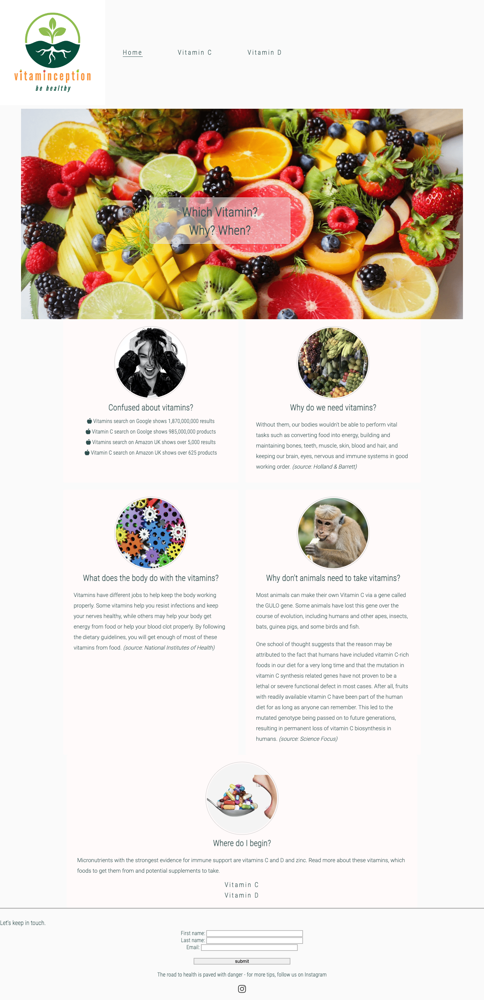

Firefox

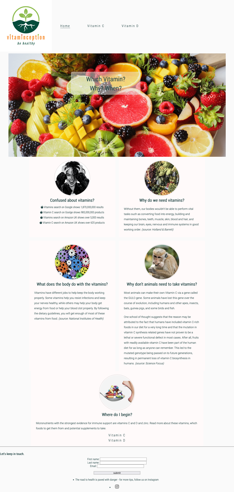

Safari

It has also been tested on iphone standard and iphone plus screens, as well as laptop screen and a desktop device. 
Responsinator validator showed a broken text overlay on rotated landscpae view on mobile screens which has not been fixed in this version. 

### Validator Testing

#### HTML Validator 
No errors were returned when passing through the official W3C validator

Index Page HTML Validator Results

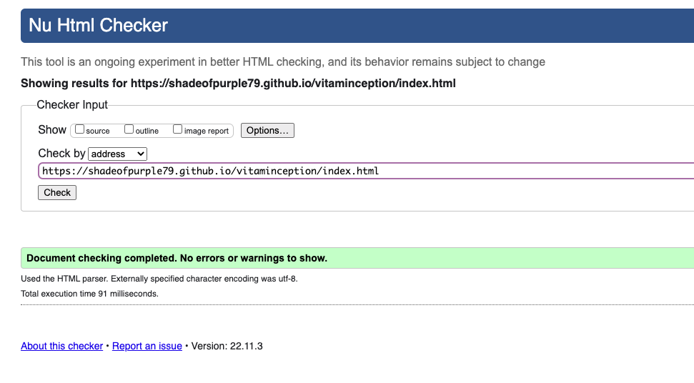

Vitamin C Page HTML Validator Results

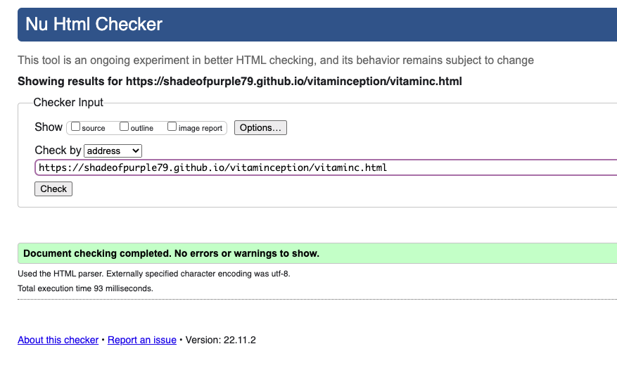

Vitamin D Page HTML Validator Results

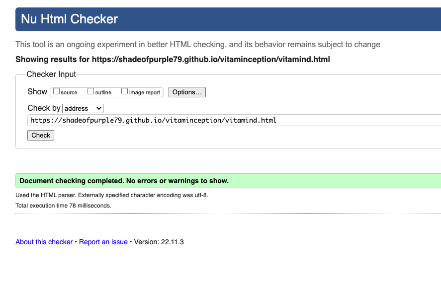

#### CSS Validator 
No errors were found when passing through the official (Jigsaw) validator

Index Page CSS Validator Results

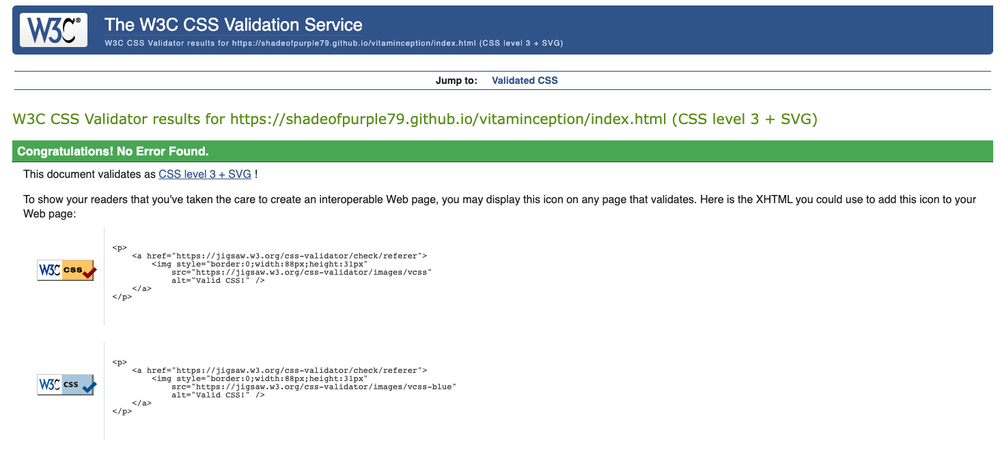

Vitamin C Page CSS Validator Results

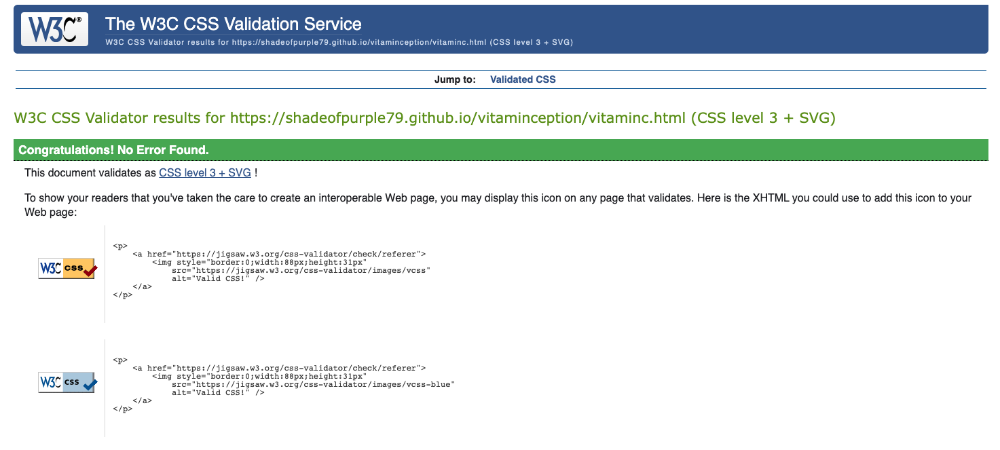

Vitamin D Page CSS Validator Results

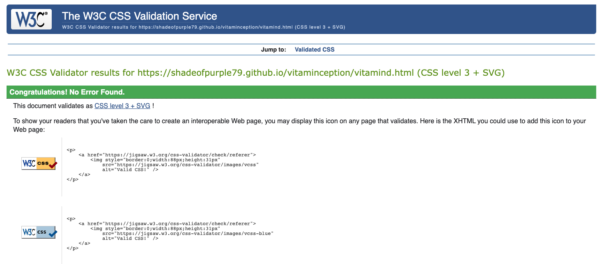

#### Responsinator Validator 
Mobile and tablet views appear to be without any issues on portatrait view, however, there are fixes to be made in the landscape view, which have been noted in the known issues list and will be fixed in an upcoming release. 

Index Page Responsinator Results

Vitamin C Page Responsinator Results

Vitamin D Page Responsinator Results

### Unfixed Bugs

- Broken text overlay on rotated landscape view on mobile screens 
- Broken text overlay on Safari desktop view
- Vitamin D third product in mini shop, product image size is distorted
- Sign up form in the footer is not aligned correctly
- Images with white background don't appear well on the website's off-white background colour
- The signup form doesn't capture the user's email address (not a bug but missing feature, requires database connection)

## Deployment

The site was deployed to GitHub pages. The steps to deploy are as follows:
- In the GitHub repository, navigate to the Settings tab
- From the source section drop-down menu, select the Master Branch
- Once the master branch has been selected, the page is automatically refreshed with a detailed ribbon display to indicate the successful deployment.
- The live link can be found here - https://shadeofpurple79.github.io/vitaminception/ 

## Credits

Images and content have been sourced from external websites, which have been explicitly cited on the website. 

### Content

Vitamins are not pharmaceuticals and therefore are not regulated as medicines. However, they are still used for their health benefits and therefore most of the content on the website were sourced from medical and scientific journals, or credible health publishers:
- https://www.nia.nih.gov
- https://www.ncbi.nlm.nih.gov
- https://www.hsph.harvard.edu
- http://sciencefocus.ust.hk
- https://onlinelibrary.wiley.com

Recommended books were sourced from the World of Books website which sells used books:
- https://www.wob.com

Shop content and recommended product links are sourced from trusted sellers of vitamin propducts:
- https://www.hollandandbarrett.com
- https://www.sainsburys.co.uk
- https://www.dolphinfitness.co.uk

### Media

The photography has been sourced from Pexel.com website which is a free stock photograpy  website. The terms of use requires the photograph filenames to be kept the same in order to acknowledge the photographer. 
- https://www.pexels.com/

The videos used on the website have been taken from Youtube. Special attention has been taken to ensure that the resources are qualified medical profesisonals. 
- https://www.youtube.com/
